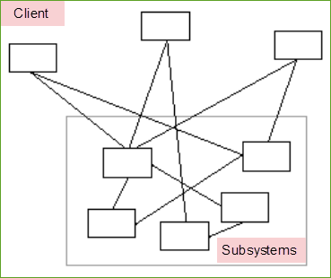
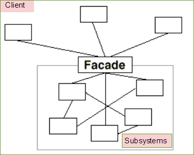

# Facade
Khi không có facade \

Khi có facade\

## Lợi ích của Facade
- Tạo ra một giao diện đơn giản cho người sử dụng một hệ thống phức tạp.
- Giảm sự phụ thuộc 
- Che giấu tính phức tạp

Các đối tượng Facade thường là Singleton bởi vì chỉ cần duy nhất một đối tượng Facade.