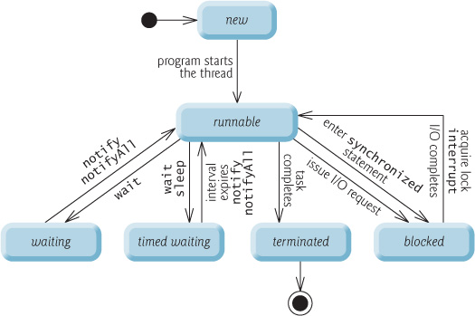

## Thread
Luồng được quản lý bởi JVM, là đơn vị nhỏ nhất xử lý task
## Multi-thread
Thực hiện nhiều luồng đồng thời.
Chia sẻ bộ nhớ chung.\
VD: Trình duyệt web hay ctr chơi nhạc cụ

# Vòng đời của Thread

Được kiểm soát JVM
- NEW: Luồng mới được tạo nhưng chưa khởi động.
- RUNNABLE: Luồng đã được khởi động và có thể chạy, nhưng có thể đang chờ lịch CPU.
- WAITING: Luồng đang chờ vô thời hạn cho đến khi được đánh thức bởi một luồng khác.
- TIMED_WAITING: Luồng đang chờ trong một khoảng thời gian nhất định hoặc chờ đợi được đánh thức sau khoảng thời gian đó.
- BLOCKED: Luồng tạm thời không chạy và đang chờ một monitor (khóa) để mở trên một đối tượng cụ thể.
- TERMINATED: Luồng đã kết thúc hoặc thoát khỏi thực thi.

## Cách tạo luồng
1. extend Thread
2. implements interface Runnable

