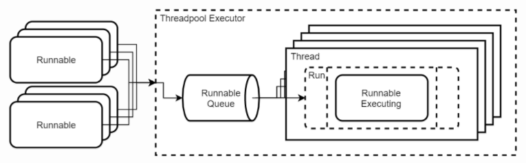

# ThreadPool
https://gpcoder.com/3548-huong-dan-tao-va-su-dung-threadpool-trong-java/

Java Concurrency API hỗ trợ một vài loại ThreadPool sau:
- **Cached thread pool:** giữ luồng còn sống (alive) và tạo mới nếu cần
- **Fixed thread pool:** Giới hạn số luồng tạo ra
- Single-threaded pool: một Thread thực thi 1 nv cùng 1 lúc.
- Fork/Join pool: Chia nhỏ task xử lý đệ quy
  
Trong thực tế, ThreadPool được sử dụng rộng rãi trong các máy chủ web, nơi một ThreadPool được sử dụng để phục vụ các yêu cầu của khách hàng. Thread pool cũng được sử dụng trong các ứng dụng cơ sở dữ liệu nơi mà một ThreadPool được sử dụng để duy trì các kết nối mở với cơ sở dữ liệu.

# Excutor 

Một Executor là một đối tượng chịu trách nhiệm quản lý các luồng và thực hiện các tác vụ Runnable được yêu cầu xử lý.
