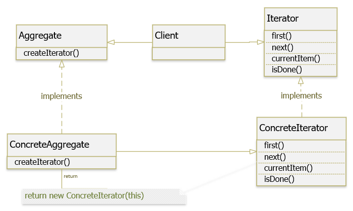
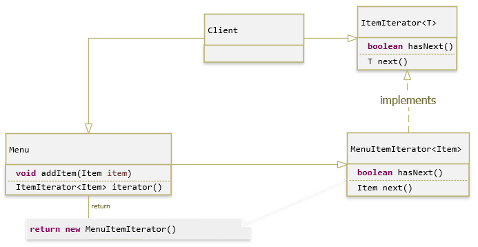

# Iterator

Cung cấp một cách thức truy cập tuần tự tới các phần tử của một đối tượng 
tổng hợp, mà không cần phải tạo dựng riêng các phương pháp truy cập cho 
đối tượng tổng hợp này

## Các thành phần:
- Aggregate: interface các phương thức tạo Iterator object
- ConcreteAggregate: nó cài đặt interface tạo Iterator để trả về một thể hiện của ConcreteIterator thích hợp.
- Iterator : là một interface hay abstract class, định nghĩa các phương thức để truy cập và duyệt qua các phần tử.
- ConcreteIterator : cài đặt các phương thức của Iterator, giữ index khi duyệt qua các phần tử.
- Client : đối tượng sử dụng Iterator Pattern, nó yêu cầu một iterator từ một đối tượng collection để duyệt qua các phần tử mà nó giữ. Các phương thức của iterator được sử dụng để truy xuất các phần tử từ collection theo một trình tự thích hợp.

Đảm bảo nguyên tắc: Open/Closed Principle (OCP)

Các bạn có thể thêm về cách implement Iterator Pattern trong JDK như:
- Tất cả các cài đặt của java.util.Iterator
- Tất cả các cài đặt của java.util.Enumeration
