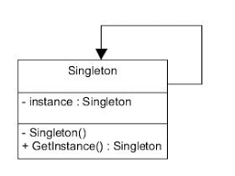
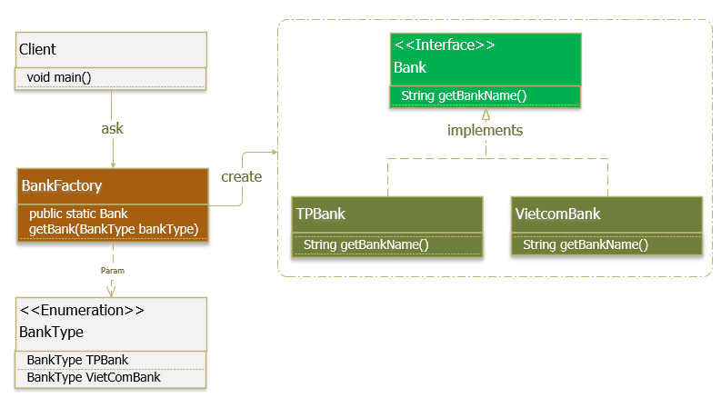
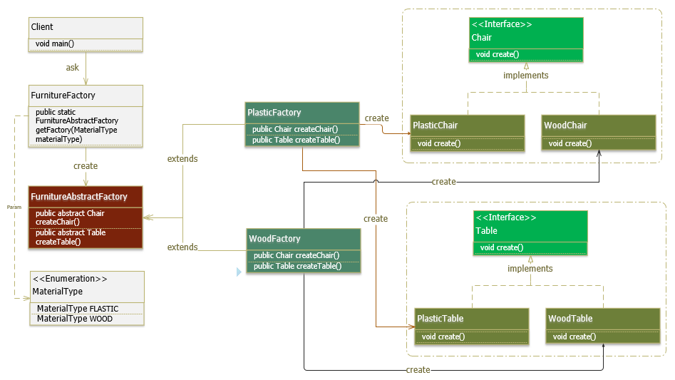

Cú pháp markdown

# Singleton
\
Chỉ tồn tại 1 Instance (thể hiện)

Được dùng cho các trường hợp giải quyết các bài toán cần truy cập 
vào các ứng dụng như: Shared resource, Logger, Configuration, 
Caching, Thread pool

# Factory Method
\
hay gọi ngắn gọn là Factory Pattern 

Factory Pattern được sử dụng khi có một class cha (super-class)
với nhiều class con (sub-class), dựa trên đầu vào và phải trả về 
1 trong những class con đó.

Factory Pattern giúp giảm sự phụ thuộc giữa các module 
(loose coupling): cung cấp 1 hướng tiếp cận với Interface thay thì
các implement. Giúp chuơng trình độc lập với những lớp cụ thể mà
chúng ta cần tạo 1 đối tượng, code ở phía client không bị 
ảnh hưởng khi thay đổi logic ở factory hay sub class.

Bao gồm các thành phần:
- Super class: có thể là **interface**, **abstract class** hay 
**class** thông thường.
- Sub Classes: implement các phương thức của super class
- Factory Class: khởi tạo các đối tượng sub class (Singleton or public static method)

#### Bạn có thể thấy Factory Pattern được áp dụng trong:
- JDK: java.util.Calendar, ResourceBundle, NumberFormat, …
- BeanFactory trong Spring Framework.
- SessionFactory trong Hibernate Framework.

# Abstract Factory
https://gpcoder.com/4365-huong-dan-java-design-pattern-abstract-factory/ \
\
Là một Pattern cấp cao hơn so với Factory Method Pattern.\
Super-factory dùng để tạo ra các Factory khác.

